# Predicción de Enfermedad Cardiaca Como Medida de Prevención.

#### Proyecto del Modulo 4 (Machine Learning) del Diplomado de Ciencias de Datos 2024.
#### Autor: Cinthya Simoneen
#### Fecha: Octubre-2024

# Objetivo: 
La enfermedad cardiaca cobra la vida de más personas cada día. Tan solo en México en 2023, las enfermedades del corazón fueron la principal causa de defunción, con 97,187 casos, lo que representa el 25% de las muertes registradas. A nivel mundial, las enfermedades cardiovasculares (ECV) son la principal causa de muerte. Se estima que 17,9 millones de personas fallecieron por ECV, lo que representa el 32% de todas las muertes a nivel global.

Basándonos en indicadores como glucosa en sangre, medición de la presión arterial y otros más, se realiza una predicción de riesgo que nos indica si un paciente está en riesgo de tener enfermedad cardiaca y de ser así derivarlo a un tratamiento preventivo. 

# Información del Dataset
El dataset con los datos necesarios para el proyecto se descarga de Keaggle, el dataset está conformado por:
 
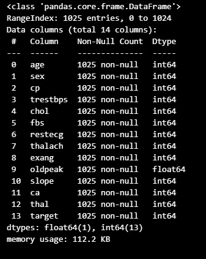

   

En donde las columnas contienen la siguiente información:

Indicadores de la columnas

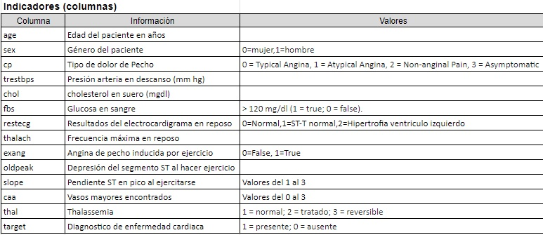

Ejemplo de los datos:

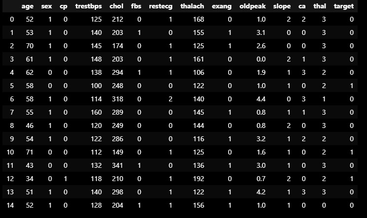

# Información de los Datos
  
### Información estadística del Dataset

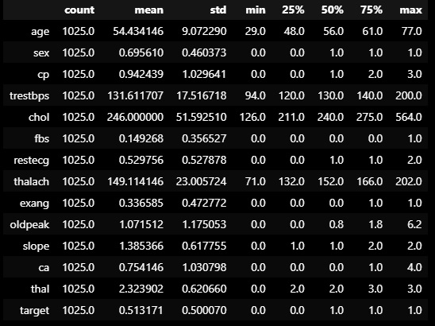

Edad: Media entre 29 y 77 años 
Género de los pacientes:1 = hombre; 0 = mujer 
Tipo de dolor de Pecho: 0 = Angina Tipica, 1 = Angina Atipica, 2 = Sin dolor , 3 = Asintomático 
Presión Arterial: Media entre 94 y 200 mm Hg. 
Colesterol: Media entre 126 y 564 mg/dl. 
Glucosa en sangre: > 120 mg/dl 1 = True, 0 = False. 
Máxima Frecuencia Cardiaca Durante Ejercicio: Media entre 71 y 202 latidos por minuto 
Angina inducida por ejercicio: 1 = si, 0 = no. 
Segmento ST deprimido al hacer ejercicio: Media entre 0 y 6.2. 
Tipo de Thalassemia: 1 = normal, 2 = tratamiento, 3 = reversible). 

### Gráficas de los datos

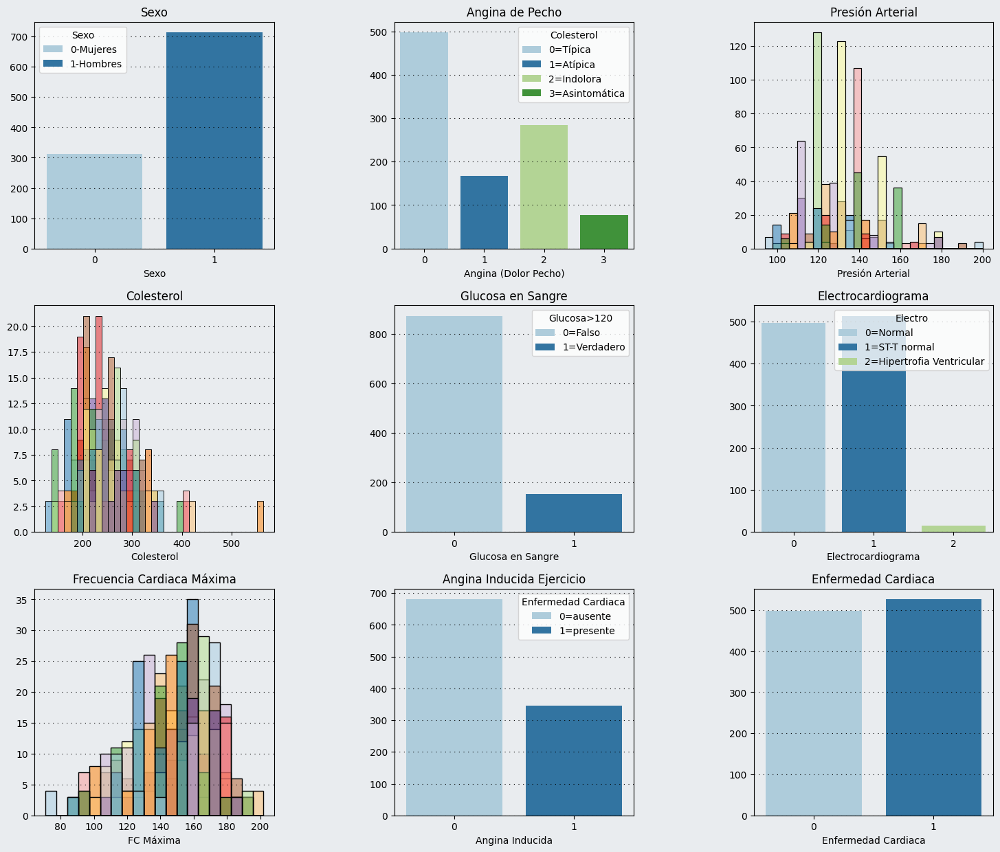

###  Distribución de Enfermedad Cardiaca de acuerdo a Indicadores

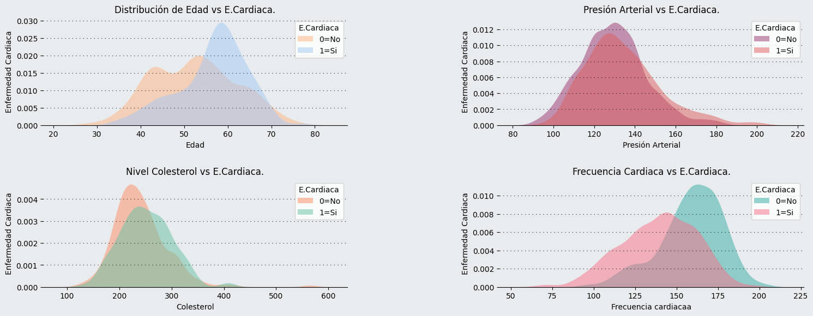

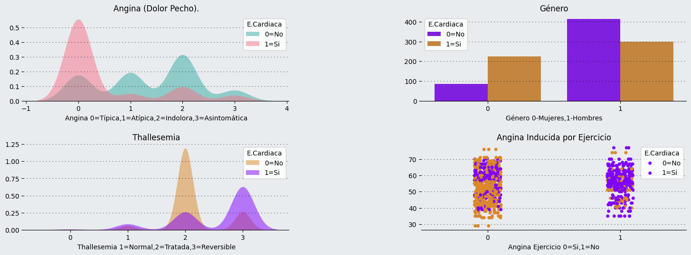

## Resultado de la revisión del dataset y de los datos
1.) Se cuenta con un total de 1025 registros  
2.) El dataset no contiene registros en NaN 
3.) Podría pensarse que entre mas edad se tiene mayor es el riesgo de padecer Enfermedad Cardiaca pero no es así. 
4.) Los pacientes con mayor frecuencia cardiaca tienen mayor riesgo de infarto 
5.) Los pacientes que no presentan dolor (angina) tienen mayores posibilidades de infartarse 
6.) Las mujeres tienen más probabilidad de infarto 
7.) Niveles altos de colesterol aumentan el riesgo de infarto 
8.) Los pacientes con Thalassemia tienen un riesgo muy alto de infarto 

# Correlación

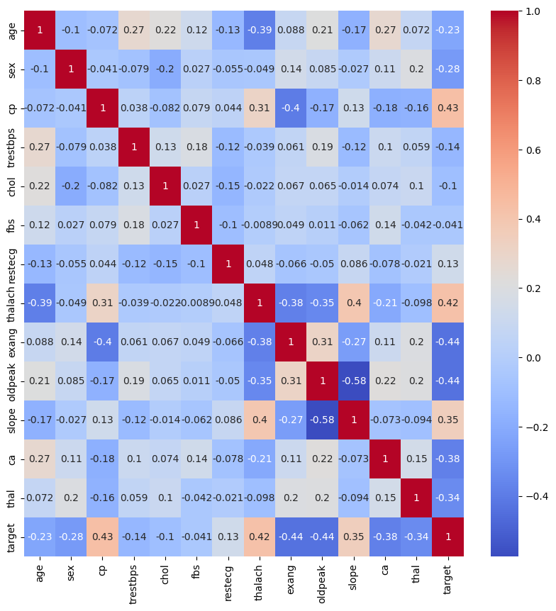

De la gráfica de correlación (mapa de calor) se deduce que hay correlación entre el dolor de pecho (angina), la frecuencia cardiaca elevada y la elevación del segmento ST al ejercitarse (Isquemia). Tener estos tres factores aumentan el riesgo de tener un ataque cardiaco.

# KMEANS
 
SCORE=0.8349990481629546
 
Utilizando KMEANS se revisa la segmentación de los pacientes por su edad y frecuencia cardiaca en reposo.

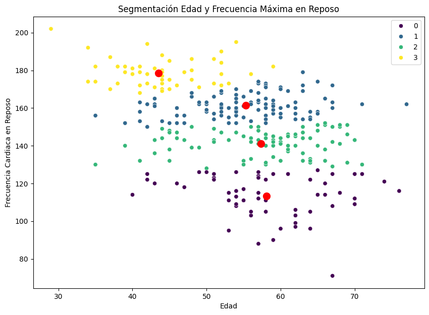

En la segmentación se puede observar que el grupo de pacientes que presentan mayor frecuencia cardiaca en reposo y con esto mayor riesgo de infarto se encuentra entre 35 y 52  años aproximadamente .

## Árboles Decisión
 
SCORE=0.9164683222585133
 

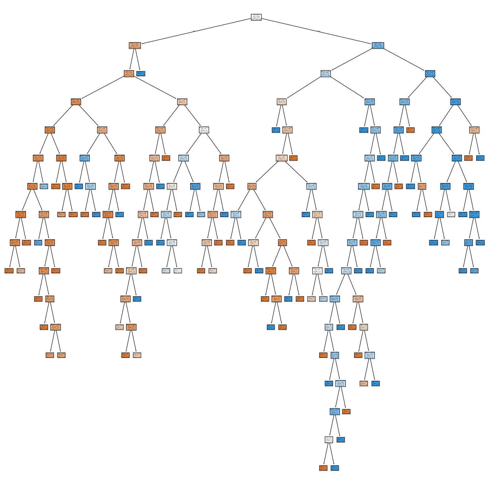

El modelo ha identificado el inicio de la clasificación con el indicador angina(dolor de pecho)

# Regresión Logística
 
SCORE =0.8512195121951219
 
Con datos de prueba se corre el modelo para predecir el riesgo de infarto cardiaco o enfermedad cardiaca los resultados son:

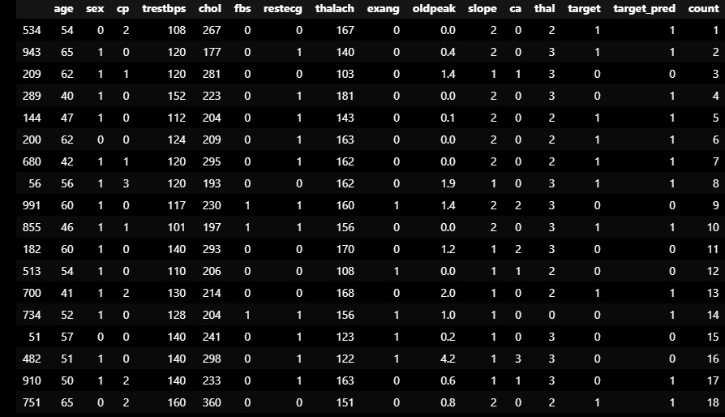

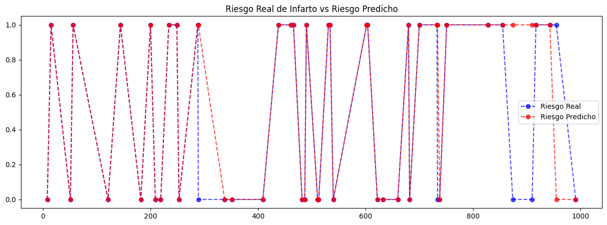

## Conclusión
Con los modelos podemos predecir a que indicadores se les debe prestar mayor atención para prevención de la enfermedad cardiaca o prevenir un infarto cardiaco por ejemplo glucosa en sangre o colesterol.El análisis de está información sirve para seleccionar pacientes que al tener un riesgo de infarto cardiaco puedan seer turnados al Área de Prevención de los Sistemas de Salud.

